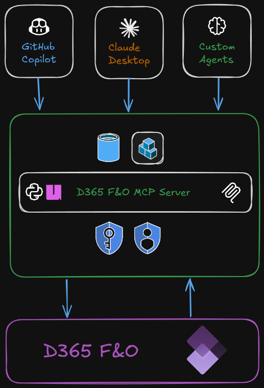

# Dynmics 365 Finance & Operations MCP Server Demo

A demonstration of the Microsoft Dynamics 365 Finance & Operations Model Context Protocol (MCP) server integration with VS Code and GitHub Copilot.

## 1. Introduction & Architecture

### What is D365FO Client MCP?

The D365FO Client & MCP server is a powerful integration tool that enables direct interaction with Microsoft Dynamics 365 Finance & Operations environments through VS Code  and GitHub Copilot using the Model Context Protocol. This tool provides:

- **Direct API Access**: Query and manipulate D365FO data entities through OData endpoints
- **Metadata Discovery**: Explore entity schemas, enumerations, and available actions
- **Real-time Operations**: Perform CRUD operations on D365FO data in real-time
- **Intelligent Assistance**: AI-powered suggestions and automation for D365FO development tasks

### Architecture Overview



The architecture consists of several key components:

1. **GitHub Copilot Extension**: Integrates MCP with the VS Code environment
2. **MCP Server**: Acts as a bridge between VS Code and D365FO
3. **D365FO OData API**: Microsoft's standard API for accessing D365FO data
4. **Authentication Layer**: Secure authentication using Azure AD client credentials
5. **Metadata Cache**: Local caching for improved performance and offline capabilities

**Data Flow:**
1. User initiates requests through VS Code
2. MCP Server processes requests and handles authentication
3. API calls are made to D365FO OData endpoints
4. Results are processed and presented back to the user in VS Code

## 2. Setup with Client Credentials

### Prerequisites

- VS Code with GitHub Copilot Extension installed
- GitHub Copilot subscription
- Access to a D365FO environment
- Azure AD application with appropriate permissions
- Python/uvx package manager - [install uv](https://docs.astral.sh/uv/getting-started/installation/)

### Authentication Setup

#### Step 1: Azure AD Application Registration

1. Register an application in Azure AD for your D365FO environment
2. Note down the following values:
   - **Tenant ID**: Your Azure AD tenant identifier
   - **Client ID**: The application (client) ID
   - **Client Secret**: The client secret value

#### Step 2: D365FO Permissions

Ensure your Azure AD application has the following permissions:
- **Dynamics 365**: Access Dynamics 365 as organization users
- **API Permissions**: Grant appropriate permissions for your D365FO environment

#### Step 3: VS Code Configuration

Create or update `.vscode/mcp.json` in your workspace:

```json
{
	"servers": {
		"d365fo-mcp-server": {
			"type": "stdio",
			"command": "uvx",
			"args": [
                "--from",
				"d365fo-client@latest",
                "d365fo-mcp-server"
			],
			"env": {
				"D365FO_CLIENT_ID": "${input:client_id}",
				"D365FO_CLIENT_SECRET": "${input:client_secret}",
				"D365FO_TENANT_ID": "${input:tenant_id}"
			}
		}
	},
	"inputs": [
		{
			"id": "tenant_id",
			"type": "promptString",
			"description": "The ID of the tenant to connect to",
			"password": true
		},
		{
			"id": "client_id",
			"type": "promptString",
			"description": "The ID of the client to connect to",
			"password": true
		},
		{
			"id": "client_secret",
			"type": "promptString",
			"description": "The secret of the client to connect to",
			"password": true
		}
	]
}
```

### Verification

After setup, verify your connection by:
1. Restarting VS Code
2. Opening the command palette (`Ctrl+Shift+P`)
3. Testing the connection to your D365FO environment

## 3. Demo

### Getting Started

Once configured, you can interact with your D365FO environment using natural language commands in VS Code. Here are some common scenarios:

#### Scenario 1: Environment Discovery

**Task**: "Show me information about my D365FO environment"

This will display:
- Environment details and version
- Available modules and installed applications
- Connection status and performance metrics

**Task**: "Create profile for https://your-fo-env.sandbox.operations.com using client credentials"

#### Scenario 2: Entity Exploration

**Task**: "Find all customer-related entities"

Example interactions:
- Search for entities: "Search for customer entities"
- Get entity schema: "Show me the schema for CustomersV3"
- List entity properties: "What fields are available in the customer entity?"

#### Scenario 3: Data Querying

**Task**: "Get the top 10 customers by credit limit"

Example queries:
- Simple queries: "Show me all customers"
- Filtered queries: "Find customers with credit limit > 50000"
- Sorted results: "List customers sorted by name"
- Field selection: "Get customer account, name, and credit limit only"

#### Scenario 4: Data Manipulation

**Task**: "Create a new customer record"

Example operations:
- Create records: "Create a new customer with account 'DEMO001'"
- Update records: "Update customer DEMO001 credit limit to 100000"
- Delete records: "Delete customer DEMO001"

#### Scenario 5: Metadata Analysis

**Task**: "Analyze sales order entities and their relationships"

Example explorations:
- Entity relationships: "Show entities related to sales orders"
- Available actions: "What actions can I perform on sales orders?"
- Enumeration values: "Show me all order status values"

#### Scenario 6: Bulk Operations

**Task**: "Export all active customers to analyze data patterns"

Example bulk operations:
- Data export: "Query all customers and show summary statistics"
- Batch updates: "Update multiple customer records"
- Data analysis: "Analyze customer distribution by region"

### Best Practices

1. **Start Small**: Begin with simple queries to understand your data structure
2. **Use Filters**: Always use appropriate filters to limit result sets
3. **Check Permissions**: Ensure your service account has appropriate permissions
4. **Monitor Performance**: Be mindful of query complexity and response times
5. **Cache Metadata**: Use metadata caching for better performance

### Common Use Cases

- **Data Migration**: Export and import data between environments
- **Business Intelligence**: Query and analyze business data
- **Integration Testing**: Validate data flows and transformations
- **System Administration**: Monitor and maintain D365FO environments
- **Development**: Prototype and test new functionality

### Troubleshooting

**Connection Issues:**
- Verify authentication credentials
- Check network connectivity
- Validate D365FO environment URL
- Review Azure AD application permissions

**Performance Issues:**
- Use field selection ($select) to limit data
- Implement proper filtering ($filter)
- Consider pagination for large datasets
- Monitor query complexity

**Permission Issues:**
- Verify service account permissions
- Check entity-level security
- Review data access policies
- Validate API permissions in Azure AD